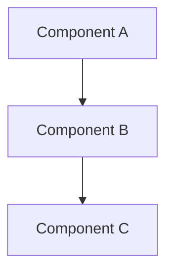

# Implementation Plan

<!-- TEMPLATE: Copy this file into your project folder as 04-plan.md and fill in each section. -->
<!-- STAGE: 4 — Technical Plan -->
<!-- WORKFLOW: workflow/04-technical-plan.md -->
<!-- INPUT: Requires approved 03-spec.md -->

## Metadata

| Field | Value |
|---|---|
| **Project** | <!-- Project name --> |
| **Date** | <!-- YYYY-MM-DD --> |
| **Author** | <!-- Who wrote this plan --> |
| **Stage** | 4 — Technical Plan |
| **Status** | Draft / Under Review / Approved |
| **Spec Reference** | `03-spec.md` |

---

## Overview

<!-- Brief summary of the technical approach. What's the big picture of how this will be built? -->


---

## Architecture

<!-- Describe the high-level architecture. Include a diagram if helpful. -->

### Components

| Component | Responsibility | Technology |
|---|---|---|
| <!-- Component name --> | <!-- What it does --> | <!-- Language / framework / tool --> |

### Architecture Diagram

<!-- Optional: include a Mermaid diagram -->



---

## Technology Choices

| Choice | Selected | Rationale |
|---|---|---|
| Language | <!-- e.g., TypeScript --> | <!-- Why this choice --> |
| Framework | <!-- e.g., Express --> | <!-- Why --> |
| Database | <!-- e.g., SQLite --> | <!-- Why --> |
| Testing | <!-- e.g., Vitest --> | <!-- Why --> |

---

## File / Folder Structure

```
project/
├── <!-- file or folder -->
├── <!-- file or folder -->
└── <!-- file or folder -->
```

---

## Dependencies

| Package / Service | Version | Purpose |
|---|---|---|
| <!-- Dependency --> | <!-- Version --> | <!-- Why needed --> |

---

## Existing Patterns to Reuse

<!-- Check memory/patterns.md — are there patterns from previous projects that apply here? -->

| Pattern | Source | How It Applies |
|---|---|---|
| <!-- Pattern name --> | <!-- Where it came from --> | <!-- How to use it here --> |

---

## Key Design Decisions

<!-- Document important technical choices made during planning. These should also be added to memory/decisions.md -->

| # | Decision | Rationale | Alternatives Considered |
|---|---|---|---|
| 1 | <!-- What was decided --> | <!-- Why --> | <!-- What else was considered --> |

---

## Risks & Mitigations

| # | Risk | Likelihood | Impact | Mitigation |
|---|---|---|---|---|
| 1 | <!-- Technical risk --> | Low / Medium / High | Low / Medium / High | <!-- How to handle it --> |

---

## Testing Strategy

<!-- How will this be tested? What kinds of tests? What coverage is expected? -->

| Test Type | Scope | Tool |
|---|---|---|
| Unit | <!-- What it covers --> | <!-- Test framework --> |
| Integration | <!-- What it covers --> | <!-- Tool --> |
| Manual | <!-- What it covers --> | <!-- Approach --> |

---

## Implementation Order

<!-- What order should components be built? What are the dependencies between them? -->

1. <!-- First thing to build (no dependencies) -->
2. <!-- Second thing (depends on 1) -->
3. <!-- Third thing -->

---

## Rollback / Recovery Plan

<!-- If this goes wrong, how do we recover? -->


---

## Approval

| Role | Name | Status | Date |
|---|---|---|---|
| Stakeholder | <!-- Name --> | Pending / Approved | <!-- Date --> |

---

<!-- NEXT STEP: Move to Stage 5 — Task Breakdown. Use templates/task.md for each task. -->
